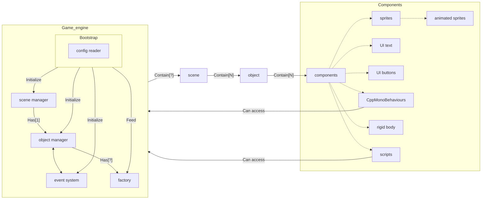

# Benchmarking ECS vs OOP

## Overview

This benchmark report compares the Entity Component System (ECS) architecture with Object-Oriented Programming (OOP) in the context of video game engine development. The goal is to evaluate the advantages and disadvantages of each approach to help developers make informed decisions when designing game systems.

## What is ECS?

Entity–component–system (ECS) is a software architectural pattern mostly used in video game development for the representation of game world objects. An ECS comprises entities composed from components of data, with systems which operate on the components. ECS follows the principle of composition over inheritance, meaning that every entity is defined not by a type hierarchy, but by the components that are associated with it. Systems act globally over all entities which have the required components.
Source: [Wikipedia](https://en.wikipedia.org/wiki/Entity_component_system)

See also: [Data-driven game object system](https://www.gamedevs.org/uploads/data-driven-game-object-system.pdf)

---

### This is the source of a lot of the value of an ES*
OOP is very good at implementing the part of any program that has lots of data floating around and lots of methods floating around which need to be executed only on a small, instanced, subset of the data in the program. OOP is very poor at implementing the “global” parts of a program, which have to operate “on everything”, or have to be invoked “from everywhere”. An Es* solves this by explicitly dealing with all the global stuff using Systems, which are outside the realm of Entity/Component.
> *ES: “Entity + Components and Systems”. (I don’t know why component doesn’t have a letter here)

---

## Who cares about ES’s and why? (Where did they invent these from?)
1. Coders who are used to writing a graphics/rendering engine and trying to keep it isolated/separate from the rest of the computer game. They learned that they can write the entire graphics engine using only PARTIAL information (a couple of aspects – no more than 2 or 3) of every OOP object that exists in the game-universe.
2. Multi-threaded coders who are looking at the concept of aspects per se (i.e. Renderable as opposed to Updateable) to allow for coarse-grained multi-threading: you are allowed one thread per aspect, and this is guaranteed safe simply because the aspects are – by definition! – independent from one another. Since a typical ES will have a dozen or more aspects, you’ve just bought yourself reasonably effective performance scaling of up to 12 separate CPU cores, for free.
3. Game designers who want to enable “everything to become anything”.
    - Do Cameras shoot people?
    - Do Bullets accept input from the player?
    - No? Now they can.
4. Coders who go a bit overboard with the Observer pattern.
> *Observer pattern: A design pattern in which an object (subject) maintains a list of its dependents (observers) and notifies them of state changes.  
Source: [Wikipedia](https://en.wikipedia.org/wiki/Observer_pattern)

Source: [Entity Systems and MMOG](https://t-machine.org/index.php/2007/11/11/entity-systems-are-the-future-of-mmog-development-part-2/)

---

## The Advantages of ECS
Here’s why Entity Component Systems are a benefit to programmers:
- Programmers can use ECS to create shorter, less complicated code.
- It offers a clean design that employs decoupling, encapsulation, modularization, and reusability methods.
- It lets programmers mix reusable parts, providing better flexibility when defining objects.
- It features very flexible emergent behavior.
- It offers an architecture for both 3D and VR development.
- It allows non-techies to script by behavior.
- It’s an easy choice for unit testing and mocking.
- You can switch components with mocked components at runtime.
- It helps you add or bolster new features.
- It’s a friendly method for multi-threading and parallel processing.
- It helps programmers separate data from the functions that can act on it.

### The Disadvantages of ECS
- ECS is not very well known, which can pose collaboration problems.
- It’s not as concretely defined as other patterns, like Model-View-Controller (MVC).
- It’s challenging to apply correctly, and easy to misuse.
- ECS requires programmers to write many small systems, which can result in inefficient code.
  Source: [Simplilearn Article](https://www.simplilearn.com/entity-component-system-introductory-guide-article)

---

## What is OOP?
Object-oriented programming (OOP) is a paradigm based on the concept of objects, which can contain data and code: data in the form of fields (often known as attributes or properties), and code in the form of procedures (often known as methods). Objects interact with one another in OOP.

Source: [Wikipedia](https://en.wikipedia.org/wiki/Object-oriented_programming)

---

### Top Advantages of OOP:
1. **Modularity**: Divides complex systems into smaller components, making the codebase easier to comprehend, create, and maintain.
2. **Reusability**: Inheritance allows code reuse.
3. **Encapsulation**: Protects data integrity by controlling access through methods.
4. **Flexibility and Scalability**: OOP allows the addition or modification of features without impacting the entire codebase.
5. **Code Organization**: Enhances collaboration and code readability.
6. **Code Maintenance**: Changes can be made to specific objects or classes without affecting other parts of the system.
7. **Reusability**: Encourages the development of reusable code.
8. **Problem Solving**: Models real-world systems effectively.

### Disadvantages of OOP:
1. **Steeper learning curve**: OOP introduces complex concepts.
2. **Increased complexity**: OOP can make larger projects more challenging.
3. **Performance overhead**: OOP often has a performance cost due to abstraction layers.
4. **Dependency management**: Inheritance and code reuse create interdependencies.
5. **Overuse of inheritance**: Can lead to tightly coupled classes, making future maintenance difficult.

Source: [Scaler Article](https://www.scaler.com/topics/oops-advantages/)

---

## What is the difference?
- **OOP** encourages data encapsulation, while **ECS** promotes exposed plain old data (POD) objects.
- **OOP** considers inheritance a first-class citizen, while **ECS** considers composition a first-class citizen.
- **OOP** colocates data with behavior, while **ECS** separates the data from behavior.

---

## What should I use for a video game?
In video game development, ECS is considered more performant than OOP, especially when managing numerous entities or when entities need to change behavior dynamically. OOP works well for traditional applications with clear hierarchies, but ECS offers flexibility and scalability in gaming.

Source: [GameDev Stack Exchange](https://gamedev.stackexchange.com/questions/200076/i-dont-get-why-ecs-is-considered-more-performant-than-oop)

## Conclusion

Both ECS and OOP have their strengths and weaknesses, our team has decided to use OOP for the project due to its familiarity and ease of use. However, we acknowledge the benefits of ECS in certain scenarios. The choice between ECS and OOP depends on the project requirements, team expertise, and performance considerations.

The flowchart of our architecture
