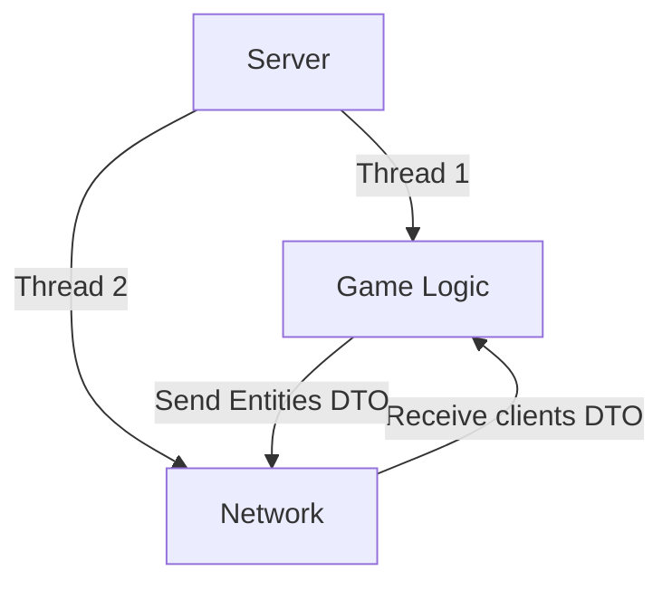
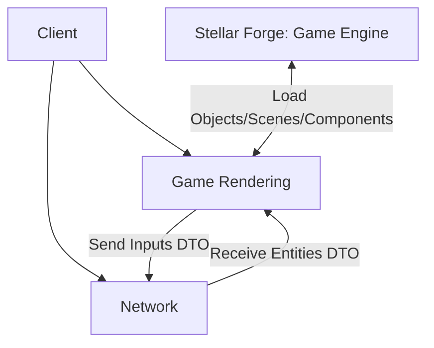
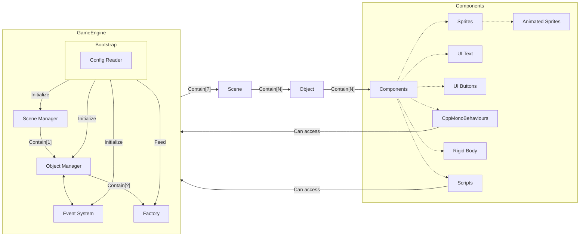

# R-Type Reborn : Developers Documentation

## Introduction

Welcome to the developers documentation for **R-Type: Reborn**!
This document is intended for developers who wish to contribute to the project or learn more about the technologies used in the game.

### Table of Contents

- [Game Overview](#game-overview)
- [Server](#server)
- [Client](#client)
- [Networking](#networking)
- [Stellar Forge: Game Engine](#stellar-forge-game-engine)

## Game Overview

**R-Type: Reborn** is a modern reimagining of the classic arcade shoot 'em up, combining nostalgic gameplay with new features and enhancements.
We have divided the project into two key components : the server and the client.
The server component is responsible for managing the game state, handling player connections, and synchronizing game data between clients.
The client component is responsible for rendering the game world, handling player input, and displaying the game state to the player.
These components communicate over a network connection using a custom protocol designed for real-time multiplayer games.

## Server

The architecture of the server is based on a multithreaded design, with separate threads for handling network communication, game logic, and data synchronization.
Here is an overview of the server components:

To see more details about the server, please refer to the [Server Documentation](server/server.md).

## Client
The architecture of the client is based on a game loop design, with separate systems for rendering, input handling, and game state management.
Here is an overview of the client components:

To see more details about the client, please refer to the [Client Documentation](client/client.md).

## Networking

The networking layer of the game is implemented using a custom protocol based on TCP and UDP sockets.
The server and client communicate using a series of data transfer objects (DTOs) to exchange game state information.
The networking layer is responsible for handling client connections, sending and receiving game data, and synchronizing the game state between clients.

For more information about the networking layer, please refer to the [Networking Documentation](networking/networking.md).

## Stellar Forge: Game Engine

The game engine used in **R-Type: Reborn** is called Stellar Forge, a custom engine developed specifically for the project.
Stellar Forge is designed to handle rendering, physics, audio, and input processing for the game.
The engine is built on top of the SFML (Simple and Fast Multimedia Library) and provides a high-level interface for game development.
All game objects, scenes, and components are managed by the engine and are json file based.
That means that you can create your own game objects, scenes, and components by creating json files and adding them to the game.
The Game Engine is also able to load and manage special behaviors for game objects thanks to the scripting interface provided by the engine.
Stellar Forge is also responsible for loading and managing assets, such as textures, sounds, and fonts, and providing a scripting interface for game logic.

Here is an overview of the Stellar Forge architecture (Yes, it's complicated):

For more information about the Stellar Forge engine, please refer to the [Stellar Forge Documentation](stellar_forge/stellar_forge.md).
