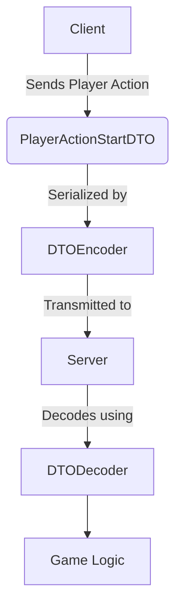
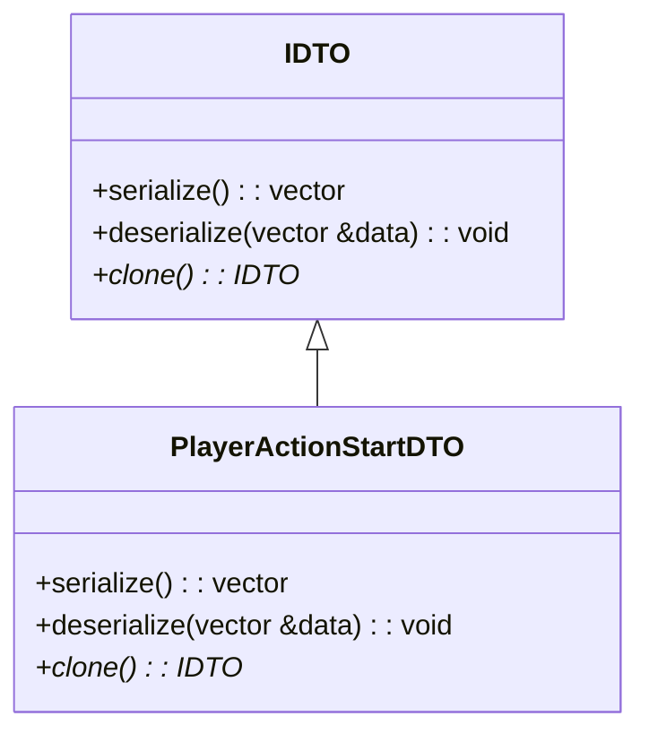
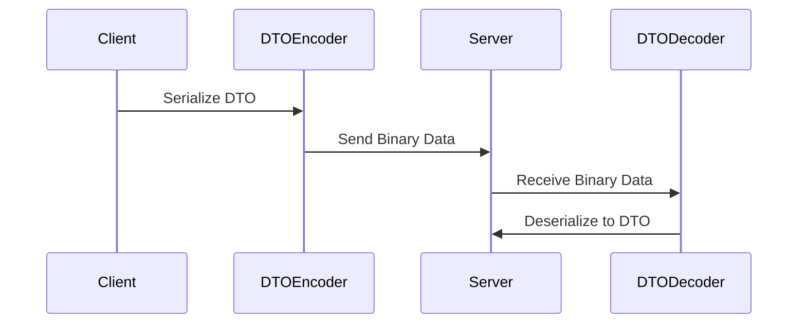
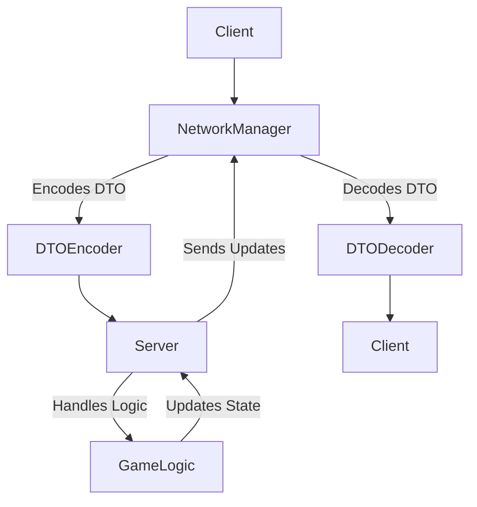

# Data Transfer Objects (DTO) Documentation

## Table of Contents

1. [Introduction](#introduction)
2. [What is a DTO?](#what-is-a-dto)
3. [Why Use DTOs?](#why-use-dtos)
4. [How DTOs Work](#how-dtos-work)
   1. [DTO Interface (`IDTO`)](#dto-interface-idto)
   2. [DTO Encoding and Decoding](#dto-encoding-and-decoding)
   3. [DTO Usage in Network Communication](#dto-usage-in-network-communication)
5. [Existing DTOs](#existing-dtos)
   1. [Game-Specific DTOs](#game-specific-dtos)
   2. [TCP Communication DTOs](#tcp-communication-dtos)
6. [How to Use DTOs](#how-to-use-dtos)
   1. [Creating a New DTO](#creating-a-new-dto)
   2. [Registering the DTO in `DTORegistry`](#registering-the-dto-in-dtoregistry)
   3. [Encoding and Decoding](#encoding-and-decoding)
7. [Best Practices](#best-practices)
8. [Conclusion](#conclusion)
9. [Additional Diagrams](#additional-diagrams)

## Introduction

In the R-Type game network, the Data Transfer Object (DTO) pattern is extensively used to encapsulate data that is exchanged between the server and clients. DTOs help maintain consistency in data representation, provide a straightforward serialization/deserialization mechanism, and simplify the communication flow across the network. This documentation will explore the purpose of using DTOs, how they work, and the best practices for implementing and using them.

## What is a DTO?

A Data Transfer Object (DTO) is an object that carries data between processes to reduce the number of method calls required. In the R-Type game, DTOs represent various game elements, actions, and configurations that are transmitted between the client and server during gameplay. Each DTO has its specific purpose, such as describing a player action, game state, or entity creation.

DTOs are designed to be lightweight and straightforward, focusing primarily on the efficient packaging of data in a format suitable for network transmission.



The above diagram shows how a player action DTO (`PlayerActionStartDTO`) is sent from the client to the server, encoded by `DTOEncoder`, transmitted, and then decoded by `DTODecoder` for further processing.

## Why Use DTOs?

1. **Decoupling and Abstraction**: DTOs allow decoupling between different components of the system. By using DTOs, the server and client do not need to have tightly coupled representations of game data, enabling easier modifications and extension of the system.
2. **Consistency in Data Exchange**: They provide a uniform format for data exchange, which helps in maintaining consistency and reducing the chances of serialization errors.
3. **Performance**: Since the data is serialized into binary format before transmission, DTOs ensure that only essential information is sent across the network, minimizing bandwidth consumption.
4. **Error Handling**: The use of a `DTORegistry` helps in identifying and managing the type of data being encoded or decoded, thereby reducing runtime errors and simplifying debugging.

## How DTOs Work

The process of using DTOs involves the following components:

### 1. **DTO Interface (`IDTO`)**

All DTOs in the R-Type project inherit from the `IDTO` interface, which provides the following key methods:

- **`serialize()`**: Converts the DTO into a binary format that can be sent over the network.
- **`deserialize(std::vector<char> &data)`**: Populates the DTO's fields from the received binary data.
- **`clone()`**: Creates a copy of the DTO, which is useful for managing copies during the encoding/decoding process.

The `IDTO` interface ensures that every DTO can be converted to and from its binary representation, making it suitable for network transmission.



The above diagram shows the relationship between the `IDTO` interface and the `PlayerActionStartDTO` class.

### 2. **DTO Encoding and Decoding**

To transmit DTOs between the server and clients, the DTO must be encoded into a binary format for transmission and decoded back into an object representation once received. This is done using the following classes:

- **`DTOEncoder`**: Responsible for encoding a given DTO into a binary format using its `encode(IDTO &dto)` method. This encoder relies on a `DTORegistry` to determine how to handle specific types of DTOs.
- **`DTODecoder`**: Responsible for decoding received binary data into the appropriate DTO using its `decode(std::vector<char> &data)` method. Like the encoder, it relies on the `DTORegistry` to ensure the correct type of DTO is instantiated.
- **`DTORegistry`**: The `DTORegistry` class keeps track of all available DTO types and provides an interface for retrieving DTOs based on their identifier. It is used both by `DTOEncoder` and `DTODecoder` to identify the correct DTO for encoding or decoding data.



The above sequence diagram illustrates the encoding and decoding process during data transmission between the client and server.

### 3. **DTO Usage in Network Communication**

DTOs are primarily used for sending game-specific information between clients and the server. Below are some common scenarios:

- **Client Sends Player Action**: When a player performs an action (e.g., moving or shooting), the client creates a `PlayerActionStartDTO`, which contains details about the player's action. This DTO is then serialized by the `DTOEncoder` and sent over the network to the server.
- **Server Sends Entity Creation**: To inform all clients about a new game entity (e.g., an enemy ship), the server creates an `EntityCreationDTO`. This DTO contains information about the entity type and position, which is then sent to all connected clients.
- **Game Speed Changes**: If the game speed needs to be updated (e.g., due to a power-up or level change), a `GameSpeedDTO` is used to encapsulate this information and transmit it to all clients.

## Existing DTOs

Below is a list of existing DTOs and their purposes:

### Game-Specific DTOs

1. **`PlayerActionStartDTO`**: Represents the start of a player action, such as moving or shooting. It contains the player ID and the action being performed.
2. **`PlayerActionStopDTO`**: Represents the stop of a player action. It contains the player ID and the action that is being stopped.
3. **`EntityCreationDTO`**: Used by the server to inform clients about the creation of a new entity in the game. It includes the entity ID, type, and position.
4. **`EntityDeletionDTO`**: Used to notify clients about the deletion of an entity from the game. It includes the entity ID and type.
5. **`EntityPositionDTO`**: Contains information about an entity's position. It is used to update clients about the current position of game entities.
6. **`GameSpeedDTO`**: Represents the game speed, used to adjust the speed of the game in response to events such as power-ups or level changes.

### TCP Communication DTOs

These DTOs are used exclusively for internal network communication over TCP. They are not intended for game logic processing.

1. **`TCPSendIdDTO`**: Used for sending the client ID from the server to the client. This is used to establish the identity of a client after it connects.
2. **`TCPCreateUDPEndpointDTO`**: Used to create a UDP endpoint via a TCP connection. It facilitates the transition from a reliable TCP handshake to the faster UDP communication used during gameplay.
3. **`TCPMessageDTO`**: Represents different types of TCP messages exchanged between server and client, such as PING/PONG for connection health checks.
4. **`ATCPDTO`**: Abstract base class for all TCP DTOs. It provides common functionalities like serialization, deserialization, and client ID management, serving as a foundation for specialized TCP DTOs.

## How to Use DTOs

1. **Creating a New DTO**

   - Define a class that inherits from the `IDTO` interface. Implement the `serialize()`, `deserialize()`, and `clone()` methods to define how your DTO will be transformed to/from binary data.

   ```cpp
   class ExampleDTO : public IDTO {
   public:
       ExampleDTO(int exampleData) : _exampleData(exampleData) {}
       ~ExampleDTO() override = default;

       std::vector<char> serialize() override {
           // Serialize _exampleData into a binary format
       }

       void deserialize(std::vector<char> &data) override {
           // Deserialize data into _exampleData
       }

       IDTO* clone() override {
           return new ExampleDTO(*this);
       }

   private:
       int _exampleData;
   };
   ```

2. **Registering the DTO in `DTORegistry`**

   - To ensure that `DTOEncoder` and `DTODecoder` can handle the new DTO, add it to the `DTORegistry`.

3. **Encoding and Decoding**

   - To send the DTO, use `DTOEncoder` to convert the DTO into binary data before transmission.
   - To receive the DTO, use `DTODecoder` to reconstruct the DTO from the received binary data.

## Best Practices

1. **Minimize Data Size**: DTOs should be as lightweight as possible to minimize bandwidth consumption. Avoid unnecessary fields and always optimize the data size.
2. **Error Handling**: Use `DTOException` for managing errors during encoding or decoding. This helps identify issues related to unrecognized DTO types or deserialization errors.
3. **DTORegistry Management**: Keep the `DTORegistry` updated with all available DTOs to avoid runtime errors during encoding/decoding. Ensure the registry is synchronized between the server and clients to handle all types consistently.
4. **Versioning**: If the game undergoes updates, ensure DTOs are versioned properly. Introducing a version field in DTOs can help handle backward compatibility with older clients or servers.

## Conclusion

DTOs play a crucial role in the R-Type game’s communication system by encapsulating game data, ensuring efficient data exchange, and maintaining separation between different parts of the system. By using `DTOEncoder`, `DTODecoder`, and `DTORegistry`, developers can create a flexible and robust data exchange mechanism that is easy to maintain and extend.

### System Overview Diagram

The following diagram represents the interaction between the `Server`, `NetworkManager`, and `GameLogic` components, highlighting the data flow and usage of DTOs.



This diagram highlights the cyclical flow of data between the client and server, showcasing the role of `NetworkManager` and `GameLogic` in processing the game state.
