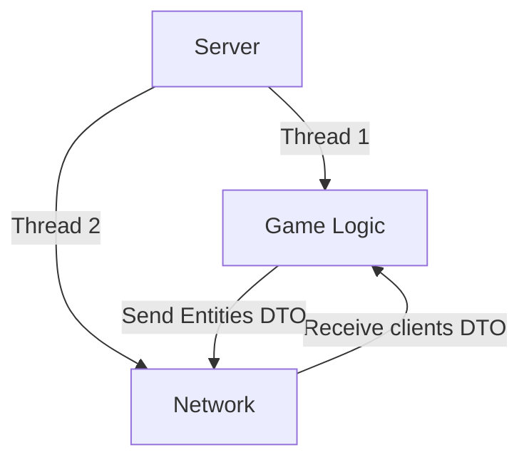
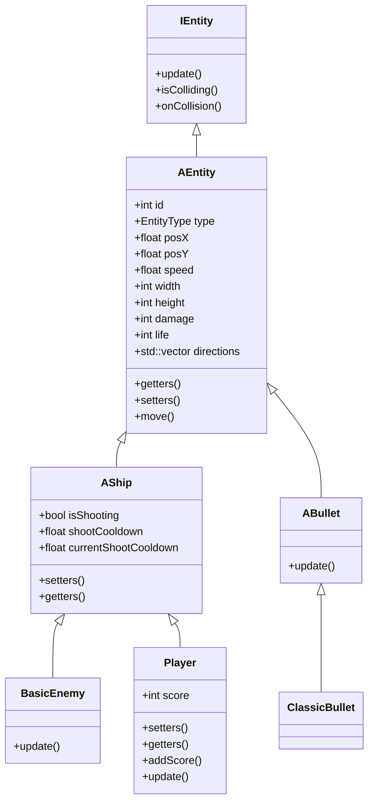
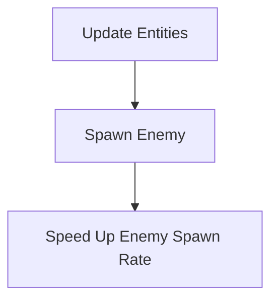

# R-Type Reborn : Server

## Table of Contents

- [Architecture](#architecture)
- [Game Logic](#game-logic)
  - [Entities](#entities)
  - [Gameplay](#gameplay)
- [Networking](#networking)
- [How to make changes](#how-to-make-changes)
  - [Entities](#entities)
  - [Gameplay](#gameplay)

## Architecture

The server is designed to handle multiple clients, each connected over a network connection. The server is responsible for managing the game state, handling player connections, and synchronizing game data between clients.

The server is divided into several components, each running in a separate thread:

- **Game Logic**: Handles the game state, including updating entities, processing player input, and managing game rules.
- **Network**: Handles network communication, sending and receiving data between the server and clients.

## Game Logic

The game logic component is responsible for managing the game state, including updating entities, processing player input, and enforcing game rules.

### Entities

Entities are the basic building blocks of the game world. Each entity represents a game object, such as a player, enemy, or projectile. Entities are composed of components that define their behavior, appearance, and interactions with other entities.
All the entities inherit from the IEntity class, which defines the basic properties and methods that all entities share. They are all contained in an Entity Manager that handles their creation, destruction, and updating.

### Gameplay

The game logic component enforces the game rules, such as collision detection, scoring, and win/lose conditions. The game logic component also handles player input, updating entities based on player actions, and generating new entities in response to game events.
The game logic component is designed to be extensible, allowing new entities, behaviors, and game mechanics to be added easily.
The loop of the game logic is call each X time by the **Server** and do the following steps:

## Networking

To see more details about the networking layer, please refer to the [Networking Documentation](../networking/networking.md).

## How to make changes

You can easily make changes to different components of the server thanks to the modular design of the project.

### Entities

To add a new entity to the game, follow these steps:

1. Create a new class that inherits from `IEntity` or one of its subclasses (e.g., `AEntity`, `AShip`, `ABullet`).
2. Implement the required methods for updating the entity, handling collisions, and responding to game events
(You need to at least implement the pure virtual methods of the `IEntity` class).

Now you can use your new entity in the game logic component by creating instances of it and adding them to the entity manager.
Since your new entity inherits from the `IEntity` class, it will automatically be updated and rendered by the game logic component.

### Gameplay

To add new game mechanics or behaviors to the game, follow these steps:

1. Identify the game rule or behavior you want to implement (e.g., scoring, power-ups, enemy AI).
2. Create a new class or function that implements the desired behavior.
3. Integrate your new behavior into the game logic component by calling it from the game loop or event handler.
4. Test your changes to ensure they work as expected and do not introduce any bugs or unintended side effects.
5. Document your changes in the code and update the relevant documentation to reflect the new features or mechanics.

By following these steps, you can easily extend the functionality of the server and add new entities, behaviors, and game mechanics to the game.
Remember that a new mechanic may need to update the `Network`, to add new DTOs or to update the existing ones.
(See the [Networking Documentation](../networking/networking.md) for more information).
